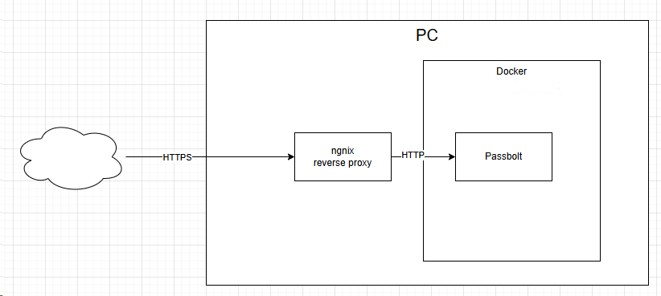

This document describes how to setup passbolt on your own instance. It presents different ways of doing it.

The recommended way to install passbolt is directly ont he VM (this is decribed in section **Setup passbolt directly on a GCE machine**). This approach has a major drawback that after doing that you have 443 port reserved for passbolt. If you would like to setup something else on https you need to use different port. 

The *advanced* way is to setup passbolt on the docker. I am doing it differently than in the tutorial on passbolt page. 

My goal is to:
- deploy Passbolt on the docker without https
- Create reverse proxy. Reverse proxy:
  - handle https
  - terminate https
  - pass requests to Passbolt

In this tutorial to validate the solutions you need to also setup domains on your domain provider, for example testpassbolt.productivitytools.top. 

- [Install on Docker](Readme/InstallOnDocker.MD)
- [Install on VM](Readme/InstallOnVM.MD)
- [Backup](Readme/Backup.MD)

