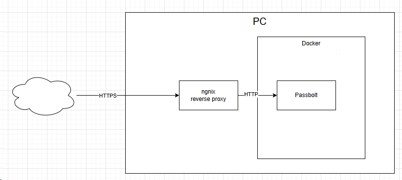
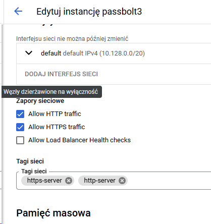
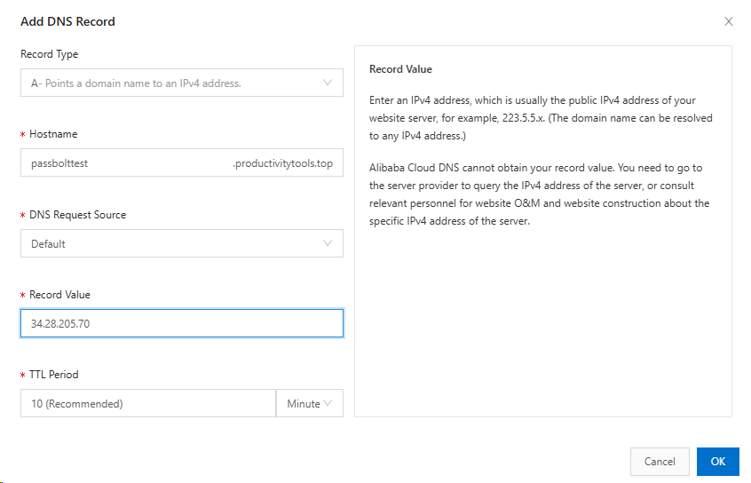
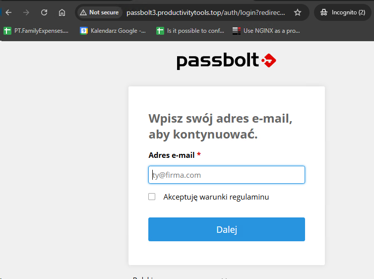
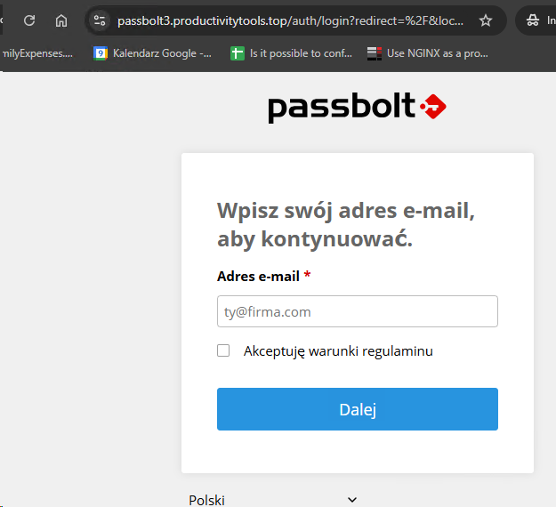
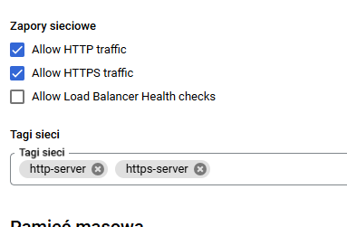
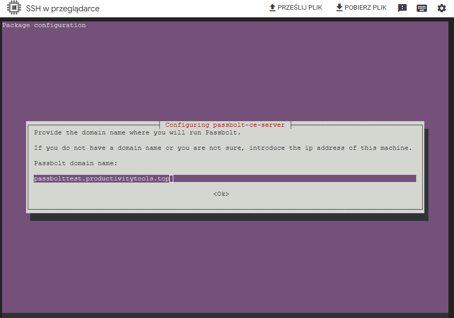
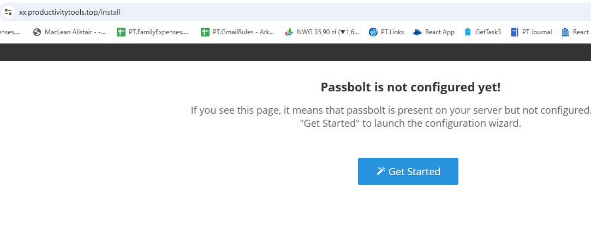
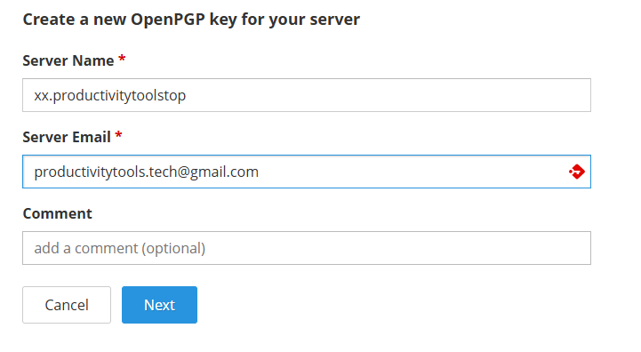

This document describes how to setup passbolt on your own instance. It presents different ways of doing it.


The recommended way to install passbolt is directly ont he VM (this is decribed in section **Setup passbolt directly on a GCE machine**). This approach has a major drawback that after doing that you have 443 port reserved for passbolt. If you would like to setup something else on https you need to use different port. 

The *advanced* way is to setup passbolt on the docker. I am doing it differently than in the tutorial on passbolt page. 

My goal is to:
- deploy Passbolt on the docker without https
- Create reverse proxy. Reverse proxy:
  - handle https
  - terminate https
  - pass requests to Passbolt




In this tutorial to validate the solutions you need to also setup domains on your domain provider, for example testpassbolt.productivitytools.top. 


## Setup passbolt on docker on a GCE machine

- Create VM

```
gcloud compute instances create "passbolt3" --machine-type "e2-standard-2" --image-project "ubuntu-os-cloud" --image-family "ubuntu-2204-lts" --subnet "default"

```

- Setup Nginx

```
sudo apt-get update
sudo apt install nginx -y
curl localhost
```

- Change Nginx default page so if you hit it you know that this is default page
```
sudo nano /var/www/html/index.nginx-debian.html
```
- Enable http and https


- Create DNS item and validate if opening page through domain works



```
curl http://passbolttest.productivitytools.top/
```

- [Install docker](https://docs.docker.com/engine/install/ubuntu/)
```
sudo apt-get update
sudo apt-get install ca-certificates curl
sudo install -m 0755 -d /etc/apt/keyrings
sudo curl -fsSL https://download.docker.com/linux/ubuntu/gpg -o /etc/apt/keyrings/docker.asc
echo \
  "deb [arch=$(dpkg --print-architecture) signed-by=/etc/apt/keyrings/docker.asc] https://download.docker.com/linux/ubuntu \
  $(. /etc/os-release && echo "$VERSION_CODENAME") stable" | \
  sudo tee /etc/apt/sources.list.d/docker.list > /dev/null
  sudo apt-get update
sudo apt-get install docker-ce docker-ce-cli containerd.io docker-buildx-plugin docker-compose-plugin
sudo docker run hello-world
sudo docker run --rm -d -p 81:80 --name my-nginx nginx

```
Setup passbolt

## Passbolt

```docker
services:
  db:
    image: mariadb:10.11
    restart: unless-stopped
    environment:
      MYSQL_RANDOM_ROOT_PASSWORD: "true"
      MYSQL_DATABASE: "passbolt"
      MYSQL_USER: "passbolt"
      MYSQL_PASSWORD: "P4ssb0lt"
    volumes:
      - database_volume:/var/lib/mysql

  passbolt:
    image: passbolt/passbolt:latest-ce
    #Alternatively you can use rootless:
    #image: passbolt/passbolt:latest-ce-non-root
    restart: unless-stopped
    depends_on:
      - db
    environment:
      APP_FULL_BASE_URL: http://testpassbolt.productivitytools.top/
      DATASOURCES_DEFAULT_HOST: "db"
      DATASOURCES_DEFAULT_USERNAME: "passbolt"
      DATASOURCES_DEFAULT_PASSWORD: "P4ssb0lt"
      DATASOURCES_DEFAULT_DATABASE: "passbolt"
      EMAIL_DEFAULT_FROM_NAME: "passbolt"
      EMAIL_DEFAULT_FROM: "pwujczyk@gmail.com"
      EMAIL_TRANSPORT_DEFAULT_HOST: "smtp.gmail.com"
      EMAIL_TRANSPORT_DEFAULT_PORT: "587"
      EMAIL_TRANSPORT_DEFAULT_USERNAME: "productivitytools.tech@gmail.com"
      EMAIL_TRANSPORT_DEFAULT_PASSWORD: ""
      EMAIL_TRANSPORT_DEFAULT_TLS: "yes"
    volumes:
      - gpg_volume:/etc/passbolt/gpg
      - jwt_volume:/etc/passbolt/jwt
    command:
      [
        "/usr/bin/wait-for.sh",
        "-t",
        "0",
        "db:3306",
        "--",
        "/docker-entrypoint.sh",
      ]
    ports:
      - 82:80
      - 444:443

volumes:
  database_volume:
  gpg_volume:
  jwt_volume:
```
docker compose -f docker-compose-ce.yaml up -d


### reverse proxy

```
sudo nano /etc/nginx/sites-available/passbolt3.productivitytools.top
```
Eventually ```sudo nano /etc/nginx/conf.d/default.conf```

```
server {
    listen       80;
    #listen  [::]:80;
    server_name passbolt3.productivitytools.top;

    location / {
        proxy_pass http://10.128.0.10:82/;
    }
}
```
Validate and reload nginx.
```
sudo nginx -t
sudo nginx -s reload
```


Setup dns:


At this moment you should have passbolt on http port loaded.

**If page won't load check if in the compose.yaml the address is aligned with the dns adderss.**





### Https

```
sudo apt install certbot python3-certbot-nginx
sudo ufw status
sudo apt-get install certbot -y 
sudo certbot --nginx -d passbolt3.productivitytools.top
```
Change the url in the docker-compose file
```yaml
     APP_FULL_BASE_URL: https://testpassbolt.productivitytools.top/
```



it could be also in /etc/nginx/sites-availiable 
```
server {
    listen       80;
    #listen  [::]:80;
    server_name testgce.productivitytools.top;

    location / {
        proxy_pass http://10.128.0.6:82/;
    }
}

server {
    listen       80;
    #listen  [::]:80;
    server_name testdocker.productivitytools.top;

    location / {
        proxy_pass http://10.128.0.6:81/;
    }
}

server {
    listen       80;
    listen       443;
    #listen  [::]:80;
    server_name testpassbolt.productivitytools.top;

    location / {
        proxy_pass http://10.128.0.6:82/;
    }
}

```
validate
```
sudo nginx -t
sudo nginx -s reload
```


## Setup passbolt directly on a GCE machine

Basic commands to init the cloud
### 
```
glcould auth login
gcloud config set project pwpassbolt1
```

On windows replace grep with findstr 

### Create GCE VM with Ubuntu
```
gcloud compute zones list |grep us-central1
gcloud config set compute/zone us-central1-a
gcloud compute images list |grep 
gcloud compute machine-types list |grep e2-standard
gcloud compute instances create "pwpassbolt" --machine-type "e2-standard-2" --image-project "ubuntu-os-cloud" --image-family "ubuntu-2204-lts" --subnet "default"
gcloud compute instsances delete
gcloud compute instances stop pwpassbolt
gcloud compute instances start pwpassbolt
```

### Nginx
```
sudo apt-get update
sudo apt install nginx -y
curl localhost
```

### Passbolt
```
curl -LO https://download.passbolt.com/ce/installer/passbolt-repo-setup.ce.sh
chmod +x passbolt-repo-setup.ce.sh
sudo ./passbolt-repo-setup.ce.sh 
sudo apt install passbolt-ce-server
```

Enable https and http in the Phanteon (maybe it could be done from cmd)



Passbolt should open




- MySQL administator username: root
- MySQL administator username: password: pawel123
- Passbolt database user: passboltadmin
- Passbolt databse name: passboltdb
- provide domain for the server




### email
- Sender name: pawel
- Sender email: productivitytools.tech@gmail.com
- SMTP host: smtp.gmail.com
- Use TLS: yes
- Port: 587
- Authentication method: Username & password
- Username: productivitytools.tech@gmail.com
- Password: google codes genearted on their page
- Client: empty

### Admin user details
- Pawel
- Wujczyk
- Username: pwujczyk@gmail.com


## not fully validated options

## GCE desktop 
Those steps are not necessary 

[tutorial](https://ubuntu.com/blog/launch-ubuntu-desktop-on-google-cloud)
[tutorial2](https://ubuntu.com/blog/launch-ubuntu-22-04-desktop-on-google-cloud)
[remote desktop](https://ubuntu.com/blog/launch-ubuntu-desktop-on-google-cloud)
- gcloud compute ssh --zone "us-central1-a" "pwpassbolt" --project "pwpassbolt1"
- sudo passwd
- sudo apt update
- sudo install tasksel
- wget https://dl.google.com/linux/direct/chrome-remote-desktop_current_amd64.deb
- sudo apt-get install ./chrome-remote-desktop_current_amd64.deb
- sudo apt install slim
- sudo apt install ubuntu-desktop
- sudo snap install chromium
- sudo bash -c ‘echo “exec /etc/X11/Xsession /usr/bin/gnome-session” > /etc/chrome-remote-desktop-session’
- go to https://remotedesktop.google.com/headless and configure connection

### Firewall 
It needs to be confirmed what worked

- sudo ufw allow 80
- gcloud compute firewall-rules create pwhttp --allow tcp:80
- gcloud compute instances add-tags pwpassbolt --tags http-server


Connect through GCP:
- Click SSH from the Pantheon UI.
- Wait a few minutes for it to fail.
- Retry without Identity-Aware Proxy.

Firewall
- sudo ufw allow 80


