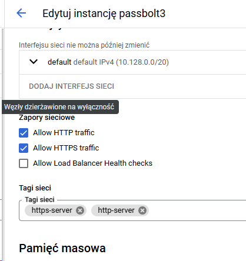
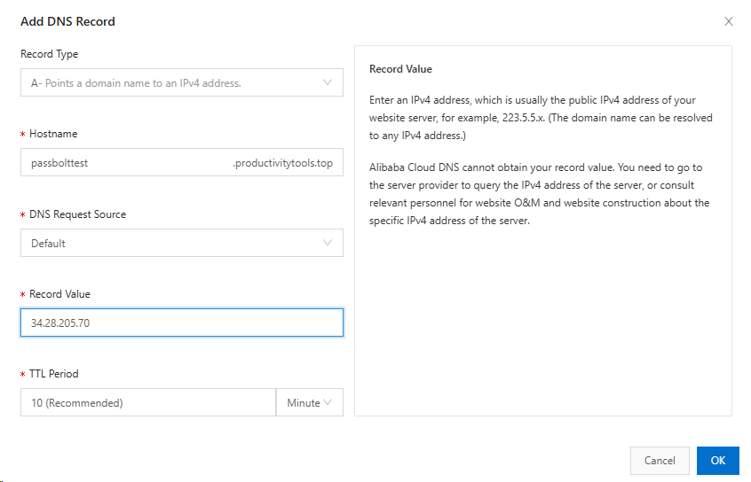
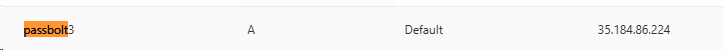
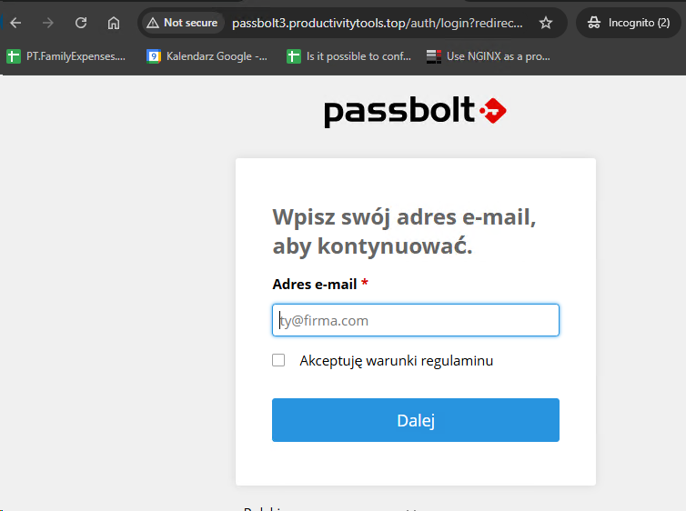
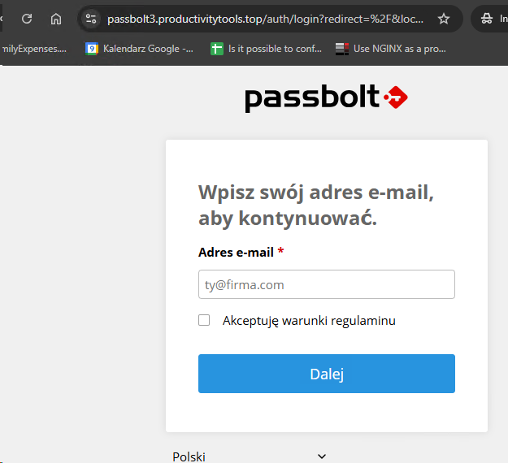

## Setup passbolt on docker on a GCE machine

- Create VM


```
gcloud compute instances create "passbolt3" --machine-type "e2-standard-2" --image-project "ubuntu-os-cloud" --image-family "ubuntu-2204-lts" --subnet "default"
```

- Setup Nginx

```
sudo apt-get update
sudo apt install nginx -y
curl localhost
```

- Change Nginx default page so if you hit it you know that this is default page
```
sudo nano /var/www/html/index.nginx-debian.html
```
- Enable http and https



- Create DNS item and validate if opening page through domain works



```
curl http://passbolttest.productivitytools.top/
```

- [Install docker](https://docs.docker.com/engine/install/ubuntu/)
```
sudo apt-get update
sudo apt-get install ca-certificates curl -y
sudo install -m 0755 -d /etc/apt/keyrings
sudo curl -fsSL https://download.docker.com/linux/ubuntu/gpg -o /etc/apt/keyrings/docker.asc
echo \
  "deb [arch=$(dpkg --print-architecture) signed-by=/etc/apt/keyrings/docker.asc] https://download.docker.com/linux/ubuntu \
  $(. /etc/os-release && echo "$VERSION_CODENAME") stable" | \
  sudo tee /etc/apt/sources.list.d/docker.list > /dev/null
  sudo apt-get update
sudo apt-get install docker-ce docker-ce-cli containerd.io docker-buildx-plugin docker-compose-plugin -y
sudo docker run hello-world
sudo docker run --rm -d -p 81:80 --name my-nginx nginx
```
Setup passbolt

## Passbolt

```
curl https://raw.githubusercontent.com/ProductivityTools-Services/ProductivityTools.Passbolt/refs/heads/main/docker-compose-ce.yaml -o docker-compose.yaml
```

```docker
services:
  db:
    image: mariadb:10.11
    restart: unless-stopped
    environment:
      MYSQL_RANDOM_ROOT_PASSWORD: "true"
      MYSQL_DATABASE: "passbolt"
      MYSQL_USER: "passbolt"
      MYSQL_PASSWORD: "P4ssb0lt"
    volumes:
      - database_volume:/var/lib/mysql

  passbolt:
    image: passbolt/passbolt:latest-ce
    #Alternatively you can use rootless:
    #image: passbolt/passbolt:latest-ce-non-root
    restart: unless-stopped
    depends_on:
      - db
    environment:
      APP_FULL_BASE_URL: http://passbolt.productivitytools.top/
      DATASOURCES_DEFAULT_HOST: "db"
      DATASOURCES_DEFAULT_USERNAME: "passbolt"
      DATASOURCES_DEFAULT_PASSWORD: "P4ssb0lt"
      DATASOURCES_DEFAULT_DATABASE: "passbolt"
      EMAIL_DEFAULT_FROM_NAME: "passbolt"
      EMAIL_DEFAULT_FROM: "pwujczyk@gmail.com"
      EMAIL_TRANSPORT_DEFAULT_HOST: "smtp.gmail.com"
      EMAIL_TRANSPORT_DEFAULT_PORT: "587"
      EMAIL_TRANSPORT_DEFAULT_USERNAME: "productivitytools.tech@gmail.com"
      EMAIL_TRANSPORT_DEFAULT_PASSWORD: ""
      EMAIL_TRANSPORT_DEFAULT_TLS: "yes"
    volumes:
      - gpg_volume:/etc/passbolt/gpg
      - jwt_volume:/etc/passbolt/jwt
    command:
      [
        "/usr/bin/wait-for.sh",
        "-t",
        "0",
        "db:3306",
        "--",
        "/docker-entrypoint.sh",
      ]
    ports:
      - 82:80
      #- 444:443

volumes:
  database_volume:
  gpg_volume:
  jwt_volume:
```
docker compose -f docker-compose-ce.yaml up -d


### reverse proxy

```
sudo nano /etc/nginx/sites-available/passbolt.productivitytools.top
```
Eventually ```sudo nano /etc/nginx/conf.d/default.conf```

```
server {
    listen       80;
    #listen  [::]:80;
    server_name passbolt.productivitytools.top;

    location / {
        proxy_pass http://127.0.0.1:82/;
    }
}
```

```
sudo ln -s /etc/nginx/sites-available/passbolt.productivitytools.top /etc/nginx/sites-enabled/
```

Validate and reload nginx.
```
sudo nginx -t
sudo nginx -s reload
```


Setup dns:


At this moment you should have passbolt on http port loaded.

**If page won't load check if in the compose.yaml the address is aligned with the dns adderss.**





### Https

```
sudo apt install certbot python3-certbot-nginx -y
sudo ufw status
sudo apt-get install certbot -y 
sudo certbot --nginx -d passbolt.productivitytools.top
```
Change the url in the docker-compose file
```
sudo nano docker-compose.yaml
```
```yaml
     APP_FULL_BASE_URL: https://testpassbolt.productivitytools.top/
```

```
sudo docker compose -f docker-compose.yaml up -d
```




## new user

```
sudo docker exec -it pwujczyklearning1-passbolt-1 sh
su -s /bin/bash -c "/usr/share/php/passbolt/bin/cake passbolt register_user -u pwujczyk@gmail.com -f pawel -l wujczyk -r admin" www-data
```