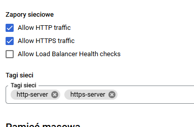
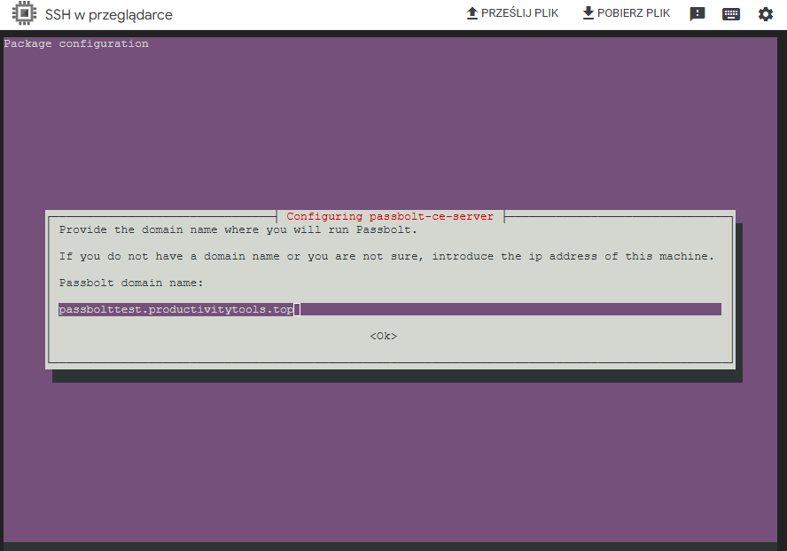
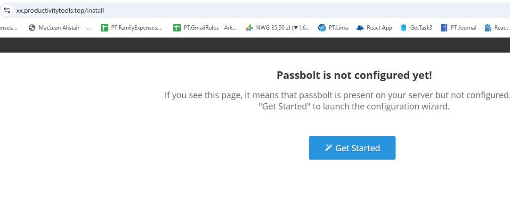
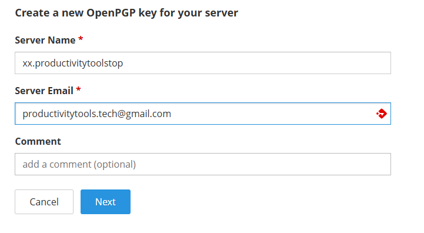

## Setup passbolt directly on a GCE machine

Basic commands to init the cloud
### 
```
glcould auth login
gcloud config set project pwpassbolt1
```

On windows replace grep with findstr 

### Create GCE VM with Ubuntu
```
gcloud compute zones list |grep us-central1
gcloud config set compute/zone us-central1-a
gcloud compute images list |grep 
gcloud compute machine-types list |grep e2-standard
gcloud compute instances create "pwpassbolt" --machine-type "e2-standard-2" --image-project "ubuntu-os-cloud" --image-family "ubuntu-2204-lts" --subnet "default"
gcloud compute instsances delete
gcloud compute instances stop pwpassbolt
gcloud compute instances start pwpassbolt
```

### Nginx
```
sudo apt-get update
sudo apt install nginx -y
curl localhost
```

### Passbolt
```
curl -LO https://download.passbolt.com/ce/installer/passbolt-repo-setup.ce.sh
chmod +x passbolt-repo-setup.ce.sh
sudo ./passbolt-repo-setup.ce.sh 
sudo apt install passbolt-ce-server
```

Enable https and http in the Phanteon (maybe it could be done from cmd)



Passbolt should open




- MySQL administator username: root
- MySQL administator username: password: pawel123
- Passbolt database user: passboltadmin
- Passbolt databse name: passboltdb
- provide domain for the server




### email
- Sender name: pawel
- Sender email: productivitytools.tech@gmail.com
- SMTP host: smtp.gmail.com
- Use TLS: yes
- Port: 587
- Authentication method: Username & password
- Username: productivitytools.tech@gmail.com
- Password: google codes genearted on their page
- Client: empty

### Admin user details
- Pawel
- Wujczyk
- Username: pwujczyk@gmail.com


## not fully validated options

## GCE desktop 
Those steps are not necessary 

[tutorial](https://ubuntu.com/blog/launch-ubuntu-desktop-on-google-cloud)
[tutorial2](https://ubuntu.com/blog/launch-ubuntu-22-04-desktop-on-google-cloud)
[remote desktop](https://ubuntu.com/blog/launch-ubuntu-desktop-on-google-cloud)
- gcloud compute ssh --zone "us-central1-a" "pwpassbolt" --project "pwpassbolt1"
- sudo passwd
- sudo apt update
- sudo install tasksel
- wget https://dl.google.com/linux/direct/chrome-remote-desktop_current_amd64.deb
- sudo apt-get install ./chrome-remote-desktop_current_amd64.deb
- sudo apt install slim
- sudo apt install ubuntu-desktop
- sudo snap install chromium
- sudo bash -c ‘echo “exec /etc/X11/Xsession /usr/bin/gnome-session” > /etc/chrome-remote-desktop-session’
- go to https://remotedesktop.google.com/headless and configure connection

### Firewall 
It needs to be confirmed what worked

- sudo ufw allow 80
- gcloud compute firewall-rules create pwhttp --allow tcp:80
- gcloud compute instances add-tags pwpassbolt --tags http-server


Connect through GCP:
- Click SSH from the Pantheon UI.
- Wait a few minutes for it to fail.
- Retry without Identity-Aware Proxy.

Firewall
- sudo ufw allow 80


